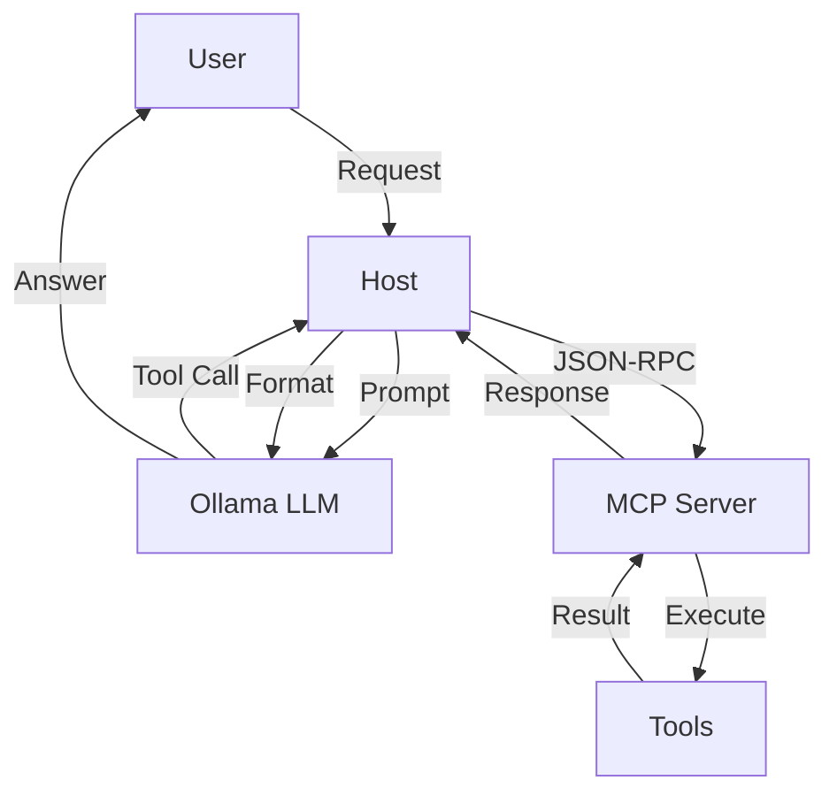
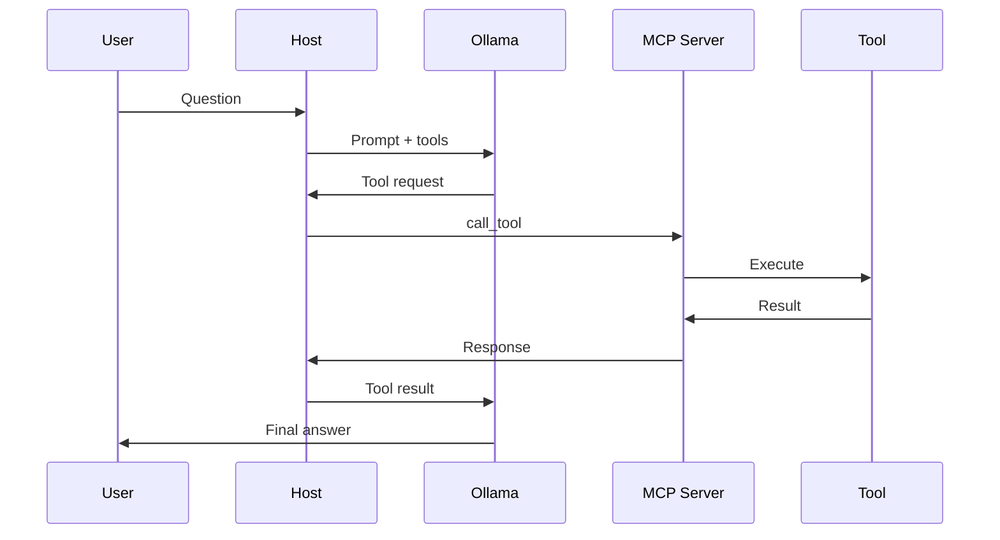

# MCP Toolbox

A comprehensive learning repository for the **Model Context Protocol (MCP)**, demonstrating how to build MCP servers, clients, and hosts with real-world tools.

## Table of Contents
- [What is MCP?](#what-is-mcp)
- [Installation](#installation)
- [Quick Start](#quick-start)
- [Architecture](#architecture)
- [Available Tools](#available-tools)
- [Testing](#testing)
- [Development Guide](#development-guide)
- [Troubleshooting](#troubleshooting)
- [Project Structure](#project-structure)

## What is MCP?

The **Model Context Protocol (MCP)** is an open protocol that standardizes how applications provide context to LLMs. It allows AI models to interact with external tools and services consistently.

**Benefits:**
- Standardized tool integration
- Mix and match tools from different providers
- Secure tool execution in isolated servers
- Clear separation between LLM and tool logic

**Architecture:**


## Installation

```bash
git clone <repository-url>
cd mcp-toolbox
python -m venv venv
source venv/bin/activate  # Windows: venv\Scripts\activate
pip install -r requirements.txt
```

**Prerequisites:** Python 3.10+, Ollama (optional), Node.js (optional)

## Quick Start

### 1. Test with MCP Inspector
```bash
npx @modelcontextprotocol/inspector python server/stdio_server.py
```
Opens web UI to test tools interactively.

### 2. Run Example Client
```bash
python client/example_usage.py
```
Demonstrates connecting and using all tools programmatically.

### 3. Chat with Ollama
```bash
ollama pull llama3
python host/run_ollama.py
```
Interactive chat with automatic tool usage.

## Architecture

### Transports

**STDIO Server** (`server/stdio_server.py`):
- Subprocess communication via stdin/stdout
- Simple, local tool execution
- Used by most MCP clients

**HTTP SSE Server** (`server/http_server.py`):
- HTTP + Server-Sent Events
- Remote tool access
- Endpoints: `GET /sse`, `POST /message`, `GET /health`

### Execution Flow


## Available Tools

| Tool | Input | Output | Purpose |
|------|-------|--------|---------|
| `yaml_to_json` | `yaml: string` | `json: string` | Convert YAML to JSON |
| `json_to_yaml` | `json: string` | `yaml: string` | Convert JSON to YAML |
| `base64_encode` | `text: string` | `encoded: string` | Base64 encoding |
| `sha256_hash` | `text: string` | `hash: string` | SHA256 hashing |
| `is_port_open` | `host: string, port: number` | `open: boolean` | Check TCP port |
| `validate_url` | `url: string` | `valid: boolean, reason?: string` | Validate URL format |

**Examples:**
```python
yaml_to_json(yaml="name: John\nage: 30")
# {"json": "{\n  \"name\": \"John\",\n  \"age\": 30\n}"}

base64_encode(text="Hello!")
# {"encoded": "SGVsbG8h"}

sha256_hash(text="test")
# {"hash": "9f86d081884c7d659a2feaa0c55ad015a3bf4f1b2b0b822cd15d6c15b0f00a08"}

await is_port_open(host="google.com", port=80)
# {"open": true}

validate_url(url="https://example.com")
# {"valid": true}
```

## Testing

### With MCP Inspector

```bash
# STDIO transport
npx @modelcontextprotocol/inspector python server/stdio_server.py

# HTTP transport (start server first)
python server/http_server.py  # Terminal 1
npx @modelcontextprotocol/inspector --config inspector-config.json  # Terminal 2
```

**Inspector Config (`inspector-config.json`):**
```json
{
  "mcpServers": {
    "toolbox": {
      "url": "http://localhost:8000",
      "transport": "sse"
    }
  }
}
```

### With pytest

```bash
pytest tests/ -v
```

Tests cover:
- Format tools (YAML/JSON conversion)
- Text tools (encoding, hashing)
- Network tools (port checking, URL validation)
- Error handling
- Edge cases

## Development Guide

### Adding a New Tool

**Step 1:** Implement tool in appropriate module

```python
# server/tools/my_tools.py
def my_tool(param: str) -> dict:
    """Tool documentation."""
    result = do_something(param)
    return {"output": result}
```

**Step 2:** Register in `server/registry.py`

```python
AVAILABLE_TOOLS["my_tool"] = {
    "name": "my_tool",
    "description": "What this tool does",
    "inputSchema": {
        "type": "object",
        "properties": {
            "param": {"type": "string", "description": "Parameter description"}
        },
        "required": ["param"]
    }
}

TOOL_FUNCTIONS["my_tool"] = my_tool
```

**Step 3:** Add tests

```python
# tests/test_my_tools.py
def test_my_tool():
    result = my_tool("test input")
    assert "output" in result
```

**Step 4:** Test with Inspector

```bash
npx @modelcontextprotocol/inspector python server/stdio_server.py
```

### Project Organization

- **server/tools/**: Tool implementations
- **server/registry.py**: Tool metadata and registration
- **server/stdio_server.py**: STDIO transport
- **server/http_server.py**: HTTP SSE transport
- **client/**: Example clients and guides
- **host/**: Ollama integration
- **tests/**: Test suites

## Troubleshooting

### Server won't start

**Issue:** `ModuleNotFoundError: No module named 'mcp'`

**Solution:**
```bash
pip install -r requirements.txt
```

### Ollama connection fails

**Issue:** `Error: Cannot connect to Ollama`

**Solution:**
```bash
# Check if Ollama is running
ollama list

# Start Ollama
ollama serve

# Pull required model
ollama pull llama3
```

### Inspector can't connect

**Issue:** Connection failed in web UI

**Solution:**
```bash
# Check server path is correct
python server/stdio_server.py  # Should run without errors

# Check Python version
python --version  # Must be 3.10+
```

### Port already in use (HTTP server)

**Issue:** `OSError: [Errno 48] Address already in use`

**Solution:**
```bash
# Find process using port 8000
lsof -i :8000  # Mac/Linux
netstat -ano | findstr :8000  # Windows

# Kill process or change port in server/http_server.py
```

### Tools not appearing

**Issue:** `list_tools` returns empty

**Solution:**
- Check `server/registry.py` imports
- Verify all tools registered in `AVAILABLE_TOOLS`
- Check server logs for import errors

## Project Structure

```
mcp-toolbox/
├── server/
│   ├── tools/
│   │   ├── __init__.py           # Tool exports
│   │   ├── format_tools.py       # YAML/JSON conversion
│   │   ├── text_tools.py         # Base64, SHA256
│   │   └── network_tools.py      # Port check, URL validation
│   ├── registry.py               # Tool registration
│   ├── stdio_server.py           # STDIO transport
│   └── http_server.py            # HTTP SSE transport
│
├── client/
│   ├── example_usage.py          # Client examples
│   └── inspector_integration.md  # Inspector guide
│
├── host/
│   ├── run_ollama.py            # Ollama integration
│   └── config.yaml              # Host configuration
│
├── tests/
│   ├── test_format_tools.py     # Format tool tests
│   ├── test_text_tools.py       # Text tool tests
│   └── test_network_tools.py    # Network tool tests
│
├── diagrams/
│   ├── architecture.mmd         # System architecture
│   └── lifecycle.mmd            # Request/response flow
│
├── requirements.txt             # Python dependencies
├── .env.example                 # Environment template
├── .gitignore                   # Git ignore rules
└── README.md                    # This file
```

## Resources

- **MCP Specification:** https://spec.modelcontextprotocol.io
- **MCP Python SDK:** https://github.com/modelcontextprotocol/python-sdk
- **MCP Inspector:** https://github.com/modelcontextprotocol/inspector
- **Ollama:** https://ollama.ai
- **FastAPI:** https://fastapi.tiangolo.com

## License

MIT License - feel free to use this as a learning resource or starting point for your own MCP servers.

## Contributing

This is a learning repository. Feel free to:
- Add new tools as examples
- Improve documentation
- Fix bugs
- Share your experiments