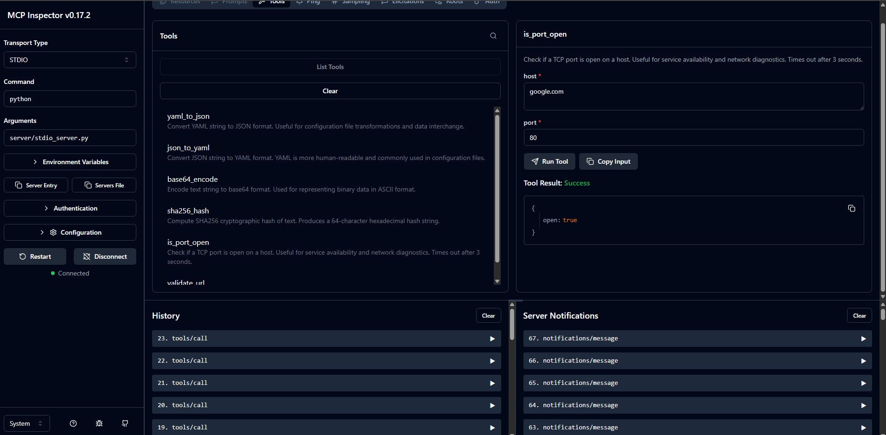

# MCP Inspector Integration Guide

## What is MCP Inspector?

The MCP Inspector is an official debugging and testing tool provided by Anthropic for MCP servers. It provides:

- **Interactive Testing**: Call tools and see responses in real-time
- **Schema Validation**: Verify your tool schemas are correct
- **Request/Response Inspection**: See the raw JSON-RPC messages
- **Development Workflow**: Test without building a full client

Think of it as "Postman for MCP servers" - an essential development tool.

## Installation

The Inspector is distributed as an npm package. You don't need to install it globally; you can run it directly with `npx`:

```bash
npx @modelcontextprotocol/inspector
```

This will:
1. Download the latest Inspector version (if needed)
2. Launch the web-based Inspector interface

## Testing STDIO Server

STDIO is the **recommended transport for local development** because it's simpler and more reliable than SSE.

### Step 1: Start the Inspector

```bash
npx @modelcontextprotocol/inspector python server/stdio_server.py
```

This command:
- Launches the Inspector web UI
- Starts your STDIO server as a subprocess
- Connects them together
- Opens browser to Inspector interface

### Step 2: Connect and Initialize

In the Inspector UI:

1. **Connection Status**: You should see "Connected" with a green indicator
2. **Click "Initialize"**: This sends the MCP initialization handshake
3. **View Server Info**: After initialization, you'll see server metadata

### Step 3: Discover Tools

1. **Click "List Tools"** button
2. **View Results**: You should see all 6 tools:
   - yaml_to_json
   - json_to_yaml
   - base64_encode
   - sha256_hash
   - is_port_open
   - validate_url

Each tool displays:
- Name
- Description
- Input schema (click to expand)



### Step 4: Test Tool Execution

Let's test the `yaml_to_json` tool:

1. **Select Tool**: Click on "yaml_to_json"
2. **View Schema**: Examine the input parameters
3. **Enter Arguments**:
```yaml
name: Raj
id: 1
```
4. **Click "Run Tool"**
5. **View Result**: You should see the JSON output

### Step 5: Test Error Handling

Try invalid input to test error handling:

1. **Select Tool**: `yaml_to_json`
2. **Invalid YAML**:
   ```json
   {
     "yaml": "invalid: yaml: [[["
   }
   ```
3. **Expected Result**: Error message about invalid YAML

## Testing HTTP SSE Server

### Important: SSE Transport Requirements

To work with MCP Inspector, your HTTP server **must use the official MCP Python SDK**. Custom SSE implementations won't work because Inspector expects:

1. MCP protocol initialization handshake
2. Proper session management
3. MCP-compliant message format
4. Endpoint discovery via SSE events

### Prerequisites

Install the required dependencies:

```bash
pip install mcp starlette uvicorn
```

### Step 1: Update Your HTTP Server

Your server needs to use the official MCP SDK. Here's the correct implementation structure:

```python
from mcp.server import Server
from mcp.server.sse import SseServerTransport
from mcp.types import Tool, TextContent

# Create MCP Server
mcp_server = Server("your-server-name")

# Create SSE transport with messages endpoint
sse_transport = SseServerTransport("/messages")

# Register tools
@mcp_server.list_tools()
async def list_tools() -> list[Tool]:
    # Return your tools
    pass

@mcp_server.call_tool()
async def call_tool(name: str, arguments: dict) -> list[TextContent]:
    # Execute tools
    pass

# Starlette routes
app = Starlette(routes=[
    Route("/sse", endpoint=handle_sse),
    Route("/messages", endpoint=handle_messages, methods=["POST"]),
])
```

See the complete updated implementation in `server/http_server.py`.

### Step 2: Start HTTP Server

In a terminal:

```bash
python server/http_server_fixed.py
```

Leave this running. You should see:
```
INFO:     Started server process [12345]
INFO:     Uvicorn running on http://0.0.0.0:8000
INFO:     SSE endpoint: http://0.0.0.0:8000/sse
INFO:     Messages endpoint: http://0.0.0.0:8000/messages
```

### Step 3: Verify Server Health

Before using Inspector, verify the server is working:

```bash
# Check health endpoint
curl http://localhost:8000/health

# Expected response:
# {"status": "healthy", "server": "mcp-toolbox", "transport": "sse"}

# Test SSE connection (should stream data)
curl -N http://localhost:8000/sse
```

### Step 4: Configure Inspector for SSE

Create a configuration file `inspector-config.json`:

```json
{
  "mcpServers": {
    "toolbox-sse": {
      "url": "http://localhost:8000/sse",
      "transport": "sse"
    }
  }
}
```

**Important**: The URL must point to the `/sse` endpoint, not the base URL.

### Step 5: Launch Inspector with Config

```bash
npx @modelcontextprotocol/inspector --config inspector-config.json
```

In the Inspector UI:
1. Select "toolbox-sse" from the server dropdown
2. Click "Connect"
3. Click "Initialize"
4. You should see "Connected" status

### Step 6: Test HTTP Server

Follow the same testing steps as STDIO:
- Click "List Tools" to see available tools
- Select a tool and provide input
- Click "Run Tool" to execute
- View results in the output panel

Monitor server logs in the terminal where HTTP server runs to see:
- Connection events
- Tool invocations
- Any errors

## Configuration File Format 

For testing multiple transports or servers, create a comprehensive `mcp-config.json`:

```json
{
  "mcpServers": {
    "toolbox-stdio": {
      "command": "python",
      "args": ["server/stdio_server.py"],
      "transport": "stdio"
    },
    "toolbox-sse": {
      "url": "http://localhost:8000/sse",
      "transport": "sse"
    }
  }
}
```

Use with:
```bash
npx @modelcontextprotocol/inspector --config mcp-config.json
```

Then select which server to test from the dropdown in Inspector UI.

## Troubleshooting

### Issue: Inspector won't connect to STDIO server

**Symptoms**: "Connection Failed" or "Server not responding"

**Solutions**:
1. Verify server runs standalone: `python server/stdio_server.py`
2. Check for Python errors in Inspector console (F12 Developer Tools)
3. Ensure no other process is using the server
4. Verify Python version 3.10+ is installed
5. Check that all dependencies are installed: `pip install -r requirements.txt`

### Issue: SSE server connection fails

**Symptoms**: "Cannot connect to http://localhost:8000/sse" or connection immediately drops

**Solutions**:

1. **Verify server is using MCP SDK**:
   - Your server MUST use `mcp.server.sse.SseServerTransport`
   - Custom SSE implementations won't work with Inspector
   - See `server/http_server_fixed.py` for correct implementation

2. **Check server is running**:
   ```bash
   curl http://localhost:8000/health
   # Should return: {"status": "healthy", ...}
   ```

3. **Test SSE endpoint directly**:
   ```bash
   curl -N http://localhost:8000/sse
   # Should stream SSE events, not return immediately
   ```

4. **Verify correct URL in config**:
   - Must include `/sse` path: `http://localhost:8000/sse`
   - NOT just `http://localhost:8000`

5. **Check port availability**:
   ```bash
   lsof -i :8000  # Linux/Mac
   netstat -ano | findstr :8000  # Windows
   ```

6. **Review server logs**: Look for errors in the terminal running the HTTP server

7. **Disable firewall/antivirus**: May block localhost connections

8. **Try different port**: Modify both server and config to use port 8001

### Issue: "SSE transport is deprecated" warning

**Note**: As of MCP specification 2025-03-26, SSE transport is deprecated in favor of Streamable HTTP. However, it still works with Inspector for development purposes.

**Recommendation**: Use STDIO transport for local development as it's simpler and fully supported:
```bash
npx @modelcontextprotocol/inspector python server/stdio_server.py
```

### Issue: Tools don't appear after connecting

**Symptoms**: List tools returns empty or errors

**Solutions**:
1. Check server initialized successfully (look for initialization in logs)
2. Verify `registry.py` is properly imported in your server
3. Check for Python import errors in server stderr
4. Click "Initialize" button in Inspector before "List Tools"
5. Check browser console (F12) for JavaScript errors
6. Restart server and reconnect

### Issue: Tool execution fails

**Symptoms**: Error when calling tools despite successful connection

**Solutions**:
1. **Verify input matches schema exactly**: Check data types and required fields
2. **Check server logs**: Look for detailed error messages in server terminal
3. **Test tool directly in Python**:
   ```python
   from registry import get_tool_function
   func = get_tool_function("yaml_to_json")
   result = func(yaml="name: test")
   print(result)
   ```
4. **Ensure dependencies installed**: `pip install -r requirements.txt`
5. **Check argument format**: Inspector sends JSON, ensure your tool accepts it
6. **Review error response**: Check both Inspector UI and server logs

### Issue: Connection drops immediately

**Symptoms**: SSE connects then immediately disconnects

**Solutions**:
1. **Check for proxy/firewall**: May block long-lived connections
2. **Verify keepalive messages**: Server should send periodic keepalives
3. **Look for server crashes**: Check server logs for exceptions
4. **Test with curl**: `curl -N http://localhost:8000/sse` should stream continuously
5. **Check browser settings**: Some extensions block SSE
6. **Review SSE implementation**: Ensure `Content-Type: text/event-stream` header

### Issue: CORS errors in browser console

**Symptoms**: "Access-Control-Allow-Origin" errors

**Solutions**:
1. **Verify CORS middleware** is configured in server
2. **Check allowed origins**: Should include Inspector's origin
3. **For development**: Set `allow_origins=["*"]`
4. **For production**: Specify exact origins needed

### Common Issues Summary

| Issue | Quick Fix | Best Solution |
|-------|-----------|---------------|
| SSE won't connect | Use STDIO instead | Implement proper MCP SDK |
| Tools not showing | Click Initialize | Check registry import |
| Execution fails | Check logs | Validate input schema |
| Connection drops | Check firewall | Add keepalives |
| CORS errors | Add middleware | Configure origins |

## Advanced Usage

### Inspecting Raw Messages

The Inspector shows raw JSON-RPC messages:

1. **Open DevTools**: Press F12 in browser
2. **Network Tab**: See HTTP requests (for SSE transport)
   - Look for "sse" and "messages" requests
   - Examine headers and payloads
3. **Console Tab**: See connection logs and errors
4. **Inspector Logs**: Built-in message viewer shows MCP protocol messages

### Testing Multiple Tools in Sequence

Create a testing workflow to verify tool chaining:

1. **Convert YAML to JSON**:
   ```yaml
   name: John Doe
   age: 30
   ```

2. **Base64 encode the JSON**:
   ```json
   {"json": "{\"name\": \"John Doe\", \"age\": 30}"}
   ```

3. **Hash the encoded string**:
   ```json
   {"text": "<base64-output>"}
   ```

4. **Validate URL format** (if applicable)

This workflow tests:
- Data transformation between tools
- Error handling at each step
- Output format compatibility

### Performance Testing

Use Inspector to test performance:

1. **Measure response times**: Check Network tab for latency
2. **Test concurrent calls**: Open multiple Inspector tabs
3. **Monitor resource usage**: Check server CPU/memory
4. **Test large inputs**: Verify handling of big YAML/JSON files

### Automated Testing

While Inspector is primarily interactive, you can:

1. **Document test cases** as JSON files:
   ```json
   {
     "tool": "yaml_to_json",
     "input": {"yaml": "name: test"},
     "expected": {"name": "test"}
   }
   ```

2. **Use Inspector to validate schemas**: Ensure schemas match implementation

3. **Export working requests**: Copy from Network tab for integration tests

4. **Share test cases**: Commit test JSON files to repository

## Best Practices

1. **Start with STDIO**: Use STDIO transport during initial development for simplicity

2. **Test Early and Often**: Use Inspector from the start of development, not just at the end

3. **Validate Schemas First**: Before writing tool logic, verify schemas in Inspector

4. **Test Error Cases**: Always test with:
   - Invalid inputs
   - Missing required fields
   - Wrong data types
   - Edge cases (empty strings, null values)

5. **Document Working Examples**: Save successful test cases as documentation

6. **Use Health Checks**: Implement `/health` endpoint for quick verification

7. **Monitor Logs**: Keep server logs visible while testing

8. **Version Control Config**: Commit `inspector-config.json` to repository

9. **Test All Transports**: Verify both STDIO and SSE work correctly

10. **Incremental Testing**: Test each tool individually before integration testing

## Comparison: STDIO vs SSE

| Feature | STDIO | SSE |
|---------|-------|-----|
| **Setup** | Simple (one command) | Complex (server + config) |
| **Dependencies** | MCP SDK only | MCP SDK + Starlette + Uvicorn |
| **Debugging** | Easy (direct logs) | Harder (HTTP layer) |
| **Performance** | Fast | Network overhead |
| **Use Case** | Local development | Production/remote access |
| **Inspector Support** | Excellent | Good (requires MCP SDK) |
| **Recommendation** | ✅ **Start here** | Use for production |

**Recommendation**: Use STDIO for all local development and testing. Only implement SSE when you need:
- Remote access to your server
- Multiple clients connecting simultaneously
- Production deployment
- Web-based client integration

## Next Steps

After validating with Inspector:

1. **Build Integration Tests**: Use `pytest` (see `tests/` directory)
2. **Develop Real Client**: See `client/example_usage.py`
3. **Connect to LLM**: Try `host/run_ollama.py`
4. **Deploy**: Move to production with proper error handling

## Resources

- [MCP Inspector GitHub](https://github.com/modelcontextprotocol/inspector) - Official Inspector repository
- [MCP Protocol Specification](https://spec.modelcontextprotocol.io) - Complete protocol docs
- [MCP Python SDK](https://github.com/modelcontextprotocol/python-sdk) - Official Python implementation
- [MCP Documentation](https://modelcontextprotocol.io) - Getting started guides
- [Starlette Documentation](https://www.starlette.io) - For SSE server implementation
- [FastAPI Documentation](https://fastapi.tiangolo.com) - Alternative to Starlette

## Conclusion

The MCP Inspector is an invaluable tool for:
- **Rapid Development**: Test tools without building a full client
- **Debugging**: See exactly what's happening in the protocol
- **Schema Validation**: Catch issues before deployment
- **Documentation**: Generate examples from working tests

**Key Takeaway**: Always start with STDIO transport in Inspector for the simplest, most reliable development experience. Only move to SSE when you specifically need HTTP-based access.